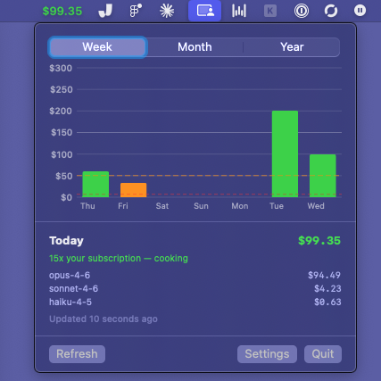

# RxBurn

A macOS menubar app that shows you how much value you're extracting from your Claude subscription.



## The idea

If you're paying $200/month for Claude Max, that's about $6.67/day. Every dollar of usage above that line means you're getting more than you paid for. RxBurn sits in your menubar and tells you how hard you're burning.

The color coding is simple:

- **Red** — you're under your daily subscription cost. You're leaving money on the table.
- **Orange** — you're above breakeven but under your daily target. Decent.
- **Green** — you're over your target. You're cooking.

The dashed red line is your subscription cost per day (the floor). The dashed orange line is your daily target — configurable in settings, defaults to $50. The goal is to clear the orange line every day. Green bars are the goal.

This isn't a budget tracker. It's the opposite. The goal is to feel good about using the thing you're paying for, not guilty about spending too much.

## Install

Download the latest `.app` from [Releases](https://github.com/Manzanita-Research/rxburn/releases), unzip, and drop it in `/Applications`.

**macOS may block the app** because it's not notarized by Apple. If you see "damaged and can't be opened," run this once after unzipping:

```
xattr -cr RxBurn.app
```

Then open it normally. Or right-click the app and choose "Open" to bypass Gatekeeper.

Or build from source with Swift 5.9+:

```
./build.sh
```

## Requirements

- macOS 14+
- Node.js (for [ccusage](https://github.com/ryoppippi/ccusage) under the hood)

## Config

On first launch, pick your plan tier (Pro, Max 5x, Max 20x) or set a custom daily cost. You can also set a daily target — the usage level you're aiming for. Config lives at `~/.config/rxburn/config.json`.

## How it works

RxBurn calls `npx ccusage@latest` every 5 minutes with `--offline` to read your local Claude usage data. No network requests to Anthropic, no API keys, no telemetry. Everything stays on your machine.
